<div align="center">



</div>

<div align="center">

<a href="https://world-cup-watchlist.netlify.app/" target="_blank" rel="noopener noreferrer">
  
</a>

<br />

_No install. No signup. You're in the stadium in one click._

</div>

---

<div align="center">

[](#)
[](#)
[](#)
[](#)
[](#)
[](#)

</div>

---

## What it is

**Matchday 2026** is a local-first tracker for every match of the FIFA World Cup 2026. Browse the full schedule with real country flags, switch between local time and UTC, mark matches as watched, and watch your tournament progress climb. No account, no backend, no noise — just the schedule and your eyes on the pitch.

---

## ▎ Screenshots

<table width="100%">
  <tr>
    <td width="50%" align="center" valign="top">
      <a href="https://id-preview--94ce4824-9802-4dc8-bedd-65f9214b26ac.lovable.app">
        
      </a>
      <sub><b>Overview</b> — hero, global progress, controls bar, timezone toggle</sub>
    </td>
    <td width="50%" align="center" valign="top">
      <a href="https://id-preview--94ce4824-9802-4dc8-bedd-65f9214b26ac.lovable.app">
        
      </a>
      <sub><b>Search &amp; filters</b> — composable status, stage and free-text search</sub>
    </td>
  </tr>
  <tr>
    <td colspan="2" align="center" valign="top">
      <a href="https://id-preview--94ce4824-9802-4dc8-bedd-65f9214b26ac.lovable.app">
        
      </a>
      <sub><b>Match cards</b> — real flags, group + venue, kickoff in your timezone, one-click watched toggle</sub>
    </td>
  </tr>
</table>

---

## ▎ Schedule

- All **104** fixtures: 72 group-stage games, Round of 32, Round of 16, quarter-finals, semi-finals, third-place, final
- Date, kickoff time, group / stage label, venue city
- Knockout slots show a neutral placeholder until the bracket resolves
- Optional **Refresh matches** button pulls the latest schedule from the [openfootball](https://github.com/openfootball/football.json) dataset and caches it locally

## ▎ Watch Tracking

- One-click eye toggle marks a match as watched
- Persisted to `localStorage` — your progress survives reloads, tabs, and sessions
- Global progress bar over all 104 matches

## ▎ Time & Timezones

- Toggle between your detected **local** timezone and **UTC**
- Day headings, kickoff times, and the timezone label all update instantly
- Preference persists across sessions

## ▎ Filters & Search

- Status filter: *Upcoming*, *Watched*, *To Watch*
- Stage filter: Group Stage, R32, R16, QF, SF, 3rd Place, Final
- Search by team, city, or group — all filters compose

## ▎ Live Indicators & Final Scores

- Matches inside a 2-hour window from kickoff are flagged **LIVE**
- Past matches you haven't watched get a **Catch up** prompt
- Finished matches show a glowing **Full time** scoreline (e.g. `2 – 1`), pulled from the openfootball `score.ft` field on the next *Refresh matches*; the losing side's row dims so the result reads at a glance

## ▎ Flags

- Real country flags from [flagcdn.com](https://flagcdn.com), retina-ready via `srcSet`
- Special codes handled: England `gb-eng`, Scotland `gb-sct`, Curaçao `cw`, DR Congo `cd`, Türkiye `tr`
- TBD knockout slots fall back to a neutral 🏳️ until resolved

## ▎ Liquid Glass UI

- Dark stadium palette: Pitch Night navy, Jersey Red, Turf Green, Scoreboard Amber
- Backdrop-blurred glass cards, animated gradient blobs, gradient text headings
- Fully responsive: mobile, tablet, desktop

---

## File layout

```text
src/
├─ lib/
│  ├─ matches.ts          # 104 bundled fixtures + Match / Stage types
│  ├─ matchesSource.ts    # openfootball fetch + normalize
│  ├─ useMatches.ts       # cached, refreshable match list hook
│  ├─ useWatched.ts       # watched-IDs Set <-> localStorage
│  └─ flags.ts            # team name -> ISO 3166-1 alpha-2 + flagUrl helpers
├─ routes/
│  ├─ __root.tsx          # html shell, head, fonts
│  └─ index.tsx           # the entire UI
└─ styles.css             # design tokens + .glass utilities + animations
```

---

## Run it

```bash
bun install
bun run dev       # http://localhost:8080
bun run build
```

---

## Customize the config

**Edit the bundled schedule** — `src/lib/matches.ts` exports `MATCHES: Match[]`. Each entry has `id`, `kickoffUTC` (ISO), `stage`, `group?`, `city`, `home`, `away`.

**Add or fix a flag** — `src/lib/flags.ts` maps team name → ISO code. Use the FIFA-style codes for the UK home nations (`gb-eng`, `gb-sct`, `gb-wls`, `gb-nir`) and the Latin-1 spellings already in the map (`Türkiye`, `Curaçao`). Anything missing falls back to a neutral flag emoji — never breaks.

**Tweak the palette** — design tokens live in `src/styles.css` under `:root`. The stadium palette:

| Token | Hex | Role |
| --- | --- | --- |
| Pitch Night | `#0B1020` | background |
| Stadium Navy | `#111A33` | surfaces |
| Jersey Red | `#E63946` | primary accent |
| Turf Green | `#2BB673` | success / watched |
| Scoreboard Amber | `#FFB703` | highlight, underline |
| Chalk White | `#F1F5F9` | text |

---

## Browsing & filtering

The status filter, stage filter, search query, and timezone toggle all compose against the same match list. Matches are grouped by day in the active timezone, sorted by kickoff. Changing the timezone re-buckets the day groups instantly without re-fetching.

## Match-watch flow

1. Click the eye icon on a card.
2. The match ID is added to a `Set` and flushed to `wc2026:watched:v1`.
3. The progress bar and the *Watched* / *To Watch* filters re-evaluate.
4. Refreshing the page restores the exact same state.

## Refreshing the schedule

Hit **Refresh matches** in the controls bar. The app fetches the latest openfootball JSON, normalizes round labels into the app's `Stage` enum, parses `"HH:MM UTC±N"` kickoffs into ISO UTC, picks up any final scores from `score.ft` (falling back to `score.et` / `score.p` for matches decided in extra time or on penalties), and writes the result to `wc2026:matches:v1`. If the fetch fails for any reason, the bundled `MATCHES` array is used — the app never goes blank.

## Responsive breakpoints

- **Mobile** (≤640px): single-column cards, stacked controls, full-width search
- **Tablet** (641–1024px): two-column cards, inline controls
- **Desktop** (≥1025px): wide grid, sticky controls, full timezone label

---

## Data & privacy

Everything lives in your browser. The app stores:

- `wc2026:watched:v1` — set of watched match IDs
- `wc2026:prefs:v1` — timezone, filter, stage, search query
- `wc2026:matches:v1` — cached schedule from the last refresh

No analytics, no accounts, no server. Clear your site data to reset.

---

## Known Limitations

- Knockout slots stay as **TBD** until the bracket resolves — flags can't be shown for a team that doesn't exist yet.
- The openfootball dataset can lag behind FIFA's official feed by a day or two around fixture changes.
- Flags depend on flagcdn.com being reachable; offline use falls back to no image.
- No push notifications — the LIVE indicator is purely visual, based on kickoff time.
- No multi-device sync — by design. Your data stays on this device.

---

## Credits

- Schedule data — [openfootball](https://github.com/openfootball/football.json)
- Flag SVGs — [flagcdn.com](https://flagcdn.com)
- Not affiliated with FIFA. *FIFA World Cup* is a trademark of FIFA. This project is a fan-made tracker for personal use.
